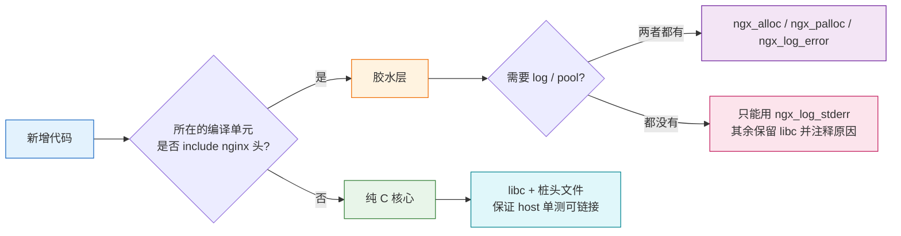

# nginx 模块编程规范

## 结论

1. **分层决定用哪套 API**:含 nginx 头的**胶水层**必须用 `ngx_*` 类型与函数;不带 nginx 依赖的**纯 C 核心**保持 libc(这是它能进 host 单测的前提)。
2. **格式串是最大雷区**:nginx 的 `ngx_vslprintf` 与 libc `printf` 语义不同,`%08x`、`%08xu` 这类写法在 nginx 里**不会打印变量**,只写出一个 NUL。
3. **本规范只约束新增与改动的代码**;存量差异见文末清单,按模块分批收敛。

## 1 适用范围、优先级与前提

| 层 | 文件 | 依赖 | 本规范要求 |
| --- | --- | --- | --- |
| 胶水层 | `ngx_rtc_core.c` `ngx_rtc_core_module.c` `ngx_rtc_shm.c` `ngx_rtc_stream_module.c` `ngx_rtc_http_module.c` `ngx_rtmp_rtc_bridge_module.c` | 真 nginx 头 | **必须**用 `ngx_*` |
| 混血层 | `ngx_rtc_core.c`(同时进 host 单测) | 真 nginx 头 + 测试桩 | 能用 `ngx_*` 就用;受 log/pool 限制的除外并注释原因 |
| 纯 C 核心 | `ngx_rtc_rtp/sdp/stun/rtcp/srtp/dtls/audio/audio_worker/jitter/ring/avsync/hsm/session_fsm` | 仅 libc | **保持 libc**,禁止引入 nginx 头 |
| 测试 | `test/` | 桩头文件 | 与被测单元风格一致 |



### 1.1 nginx 的三个前提

下面每条规则都能追溯到这三个前提之一。**遇到本文没写到的场景时按前提判断,不要去找
"最像的先例"** —— 先例覆盖不到的地方,正是前提起作用的地方。

**1. 一次事件循环迭代的工作量必须是有界的。** 一个 worker 就是一条事件循环,该 worker 的
所有连接都挂在它上面;任何一次迭代里的无界工作,都会让其余连接一起等。由此导出:回调内
禁止阻塞(§6)、重活切到 `ngx_add_timer` / `ngx_post_event` 分片(§6)、热路径零分配零
syscall(§4 的「禁止每包分配」、§2 缓存时钟的 `ngx_time()`)。更重要的是它的另一半:
**做不到有界时就降级,而不是硬撑** —— 丢包、回 4xx/5xx、返回 `NGX_ERROR` 都不是失败,
是这条前提的正常出口(§9)。反过来看,「反正能跑」的写法都属于同一个错:排空循环(§6.1)、
静默截断、越界 `break` 输出半截 JSON(§4)。

**2. 内存的生命周期由归属决定,不由分配点决定。** nginx 几乎从不 `free`:对象的存活期
跟着连接 / 请求 / 进程走,池的回收就是唯一的释放点。所以 §4 那张选型表不是风格偏好 ——
「这块内存活多久、归谁」决定了用 `ngx_palloc` 还是 `ngx_alloc` 还是 shm。跨 worker 的
裸指针是唯一打破这条的地方,因此必须有明确的所有权与宽限期约定,并写进注释。

**3. 顺着框架走,不自己发明。** nginx 已经给了挂载点:模块骨架、指令表、`create_conf` /
`init_conf`、`postconfiguration`、`init_process`、`ngx_*_get_module_ctx`、错误码、
`ngx_log_*`。§2 的类型替换、§7 的内置 set 函数、§8 的 ctx、§9 的错误码都是这一条的推论。
反过来,直接强转框架内部字段(`c->data`)、另立一套错误码或日志,都属于这类偏离,
必须写注释说明依据。

## 2 类型、函数与数据结构

### 2.1 libc 调用替换

胶水层内出现的 libc 调用一律替换:

| libc | nginx | 说明 |
| --- | --- | --- |
| `memcpy` | `ngx_memcpy` / `ngx_cpymem` | `ngx_cpymem` 返回目的指针 + n |
| `memset(s, 0, n)` | `ngx_memzero` | |
| `memset(s, c, n)` | `ngx_memset` | |
| `memcmp` | `ngx_memcmp` | |
| `strlen` | `ngx_strlen` | |
| `strcmp` / `strncmp` | `ngx_strcmp` / `ngx_strncmp` | |
| `strchr` / `strstr` | `ngx_strlchr` / `ngx_strnstr` | |
| `snprintf` / `sprintf` | `ngx_snprintf` / `ngx_slprintf` / `ngx_sprintf` | 见第 3 节,格式串语义不同 |
| `malloc` / `calloc` | `ngx_alloc` / `ngx_calloc` / `ngx_palloc` / `ngx_pcalloc` | 需要 `ngx_log_t *` 或 `ngx_pool_t *` |
| `free` | `ngx_free` | |
| `time(NULL)` | `ngx_time()` / `ngx_current_msec` | 缓存时钟:免 syscall、免疫系统时钟回拨 |
| `random` / `rand` | `ngx_random` | |
| 类型 `int` / `unsigned` / `char *` | `ngx_int_t` / `ngx_uint_t` / `u_char *` | 定长语义处用 `uint32_t` 等仍可接受 |

**缓冲区的长度参数优先用 `sizeof(变量) - 1`**,而不是重复的字面量。

### 2.2 数据结构优先用 nginx 的

这是前提 3(顺着框架走)在数据上的体现。手写容器几乎总会漏掉 nginx 已经解决的东西 ——
内存归属、O(1) 删除、跨进程可见性 —— 而且多一套生命周期就是多一处泄漏点。

| 场景 | 用 | 不要 |
| --- | --- | --- |
| 带长度的字符串 | `ngx_str_t`(配 §3.2 的 `%V` / `%*s`) | `char *` + 另存一个 len,或只靠 NUL 结尾 |
| 动态数组 | `ngx_array_t`(追加用 `ngx_array_push`) | 手写 `realloc` 扩容循环 |
| 只追加的列表 | `ngx_list_t` | 手写链表 |
| 对象自带的双向链表 | `ngx_queue_t`(侵入式,删除 O(1)) | 手写单向链表 + 找前驱 |
| 按名字查对象 | `ngx_rbtree_t` + `ngx_str_node_t` | 手写 BST,或线性扫描 |
| 静态 str → value 表 | `ngx_hash_t` / `ngx_hash_keys_arrays_t` | 一串 `if-else` / `strcmp` 链 |
| 跨进程共享的计数器 | `ngx_atomic_t` + `ngx_atomic_fetch_add` | 普通整型(跨 worker 会撕裂) |
| 共享内存 | `ngx_slab_pool_t` + `ngx_slab_alloc` | `ngx_create_pool`(池是进程私有的) |
| 缓冲链 | `ngx_chain_t` / `ngx_buf_t` —— **但热路径 UDP 单包不用**,理由见 §4 | —— |

本仓已经在用:`ngx_rtc_shm.c` 的注册表用 `ngx_queue_t`(源列表、会话列表、订阅者列表)
加 `ngx_str_node_t` / `ngx_rbtree`(源名索引)。**新增容器前先确认这几个不够用。**

## 3 格式化字符串(高风险区)

nginx 用自研的 `ngx_vslprintf`,**不是** `printf` 的薄封装。

### 3.1 标志位与转换字符是两回事

`u`、`x`、`X`、`m`、`*`、`.` 都是**标志位**(设置 `sign=0`/`hex`/宽度等),格式串必须**另有一个转换字符**。

| 想要 | 正确写法 | 错误写法 |
| --- | --- | --- |
| `ngx_uint_t` | `%ui` | `%u` ← 会输出空串 |
| `size_t` | `%uz` | |
| `uint32_t` | `%uD` | |
| `uint64_t` | `%uL` | |
| 8 位零填充小写十六进制 | `%08uxD` | `%08x`、`%08xu` ← 均输出空串 |
| `ngx_atomic_uint_t` | `%uA` | |

**踩坑记录**:本仓原代码用 `snprintf(buf, n, "%08xu", (unsigned) ngx_random())`,在 glibc 下输出 8 位 hex **加一个字面 `u`**(日志里 `ufrag=34681fcfu` 即为证据);直接换成 `ngx_snprintf` 后因为 `u` 之后没有转换字符,变量压根不打印,只剩一个 NUL,`ice_ufrag` 变成空串。

### 3.2 字符串

| 格式 | 入参 | 注意 |
| --- | --- | --- |
| `%s` | `u_char *`,NUL 结尾 | 受 `last` 限制 |
| `%*s` | `size_t` 长度 + `u_char *` | 等价 `%.*s`,**不修改**入参 |
| `%V` | `ngx_str_t *` | 本仓钉的 nginx 1.31.1 经 `ngx_sprintf_str` **按值**处理,不改写入参(已核 `ngx_string.c:255` 与 `:571`) |
| `%v` | `ngx_variable_value_t *` | 同上 |

`%V` 本身没有额外陷阱,但它把 `ngx_str_t` 的语义绑死在 nginx 实现上。**要跨 nginx 版本复用的代码用 `%*s`**,它只传长度 + 指针,与实现无关:

```c
    ngx_snprintf(buf, sizeof(buf) - 1, "%*s/%*s%Z",
                 s->app.len, s->app.data, s->stream.len, s->stream.data);
```

### 3.3 边界与结尾

- `%c`、`%Z`、`%N` **不做 `last` 越界检查**,直接 `*buf++`。用 `%Z` 时长度参数必须传 `sizeof(buf) - 1`。
- `ngx_sprintf` **无长度上限**,任何来自外部数据的拼接一律用 `ngx_snprintf` / `ngx_slprintf`。
- 格式串与实参类型不匹配时 nginx 不报错也不提示,**静默输出错值**,改格式串必须逐条对着 `ngx_vslprintf` 源码核对。

## 4 内存

| 场景 | 用法 |
| --- | --- |
| 随请求存活 | `ngx_palloc` / `ngx_pcalloc(r->pool, ...)` |
| 跨请求存活(会话、source) | 独立 `ngx_create_pool` + `ngx_pool_cleanup_add`,或在明确的生命周期终点 `ngx_free` |
| 必须活过连接池(posted event) | `ngx_alloc` / `ngx_free` |
| 多 worker 共享 | `ngx_shm_zone` + `ngx_slab_pool_t`;指针用 `ngx_shmtx_t` 保护;计数用 `ngx_atomic_*` |
| 热路径 | **禁止**每包分配。预分配固定容量数组,复用常驻缓冲 |

约定:

- `ngx_alloc` 不置零,需要零值用 `ngx_calloc`。
- `ngx_free` 之后立即置 `NULL`。
- 只有 `ngx_slab_alloc_locked` / `ngx_slab_free_locked` 可以在已持锁时调用,其余走带锁版本。
- 共享内存里的跨 worker 裸指针必须有明确的所有权与宽限期约定,并写进注释(参见 `ngx_rtc_shm.c` 的 `expires` 机制)。
- **禁止在栈上放大缓冲**:SDP offer、请求体这类外部可控数据用池分配;确需栈缓冲时必须显式校验长度上限并拒绝超限输入。
- **静默截断是本仓已复现的一类缺陷,不是理论风险**。`ngx_snprintf` 只受 `last` 约束,**不报告溢出**:`%s` / `%V` / `%*s` 超长时它写一半就停,返回值仍是一个有效指针。因此:
  - 从外部输入解析出的定长字符串(JSON 字段、SDP、流名),**放不下就是错误** —— 返回 `NGX_ERROR` / 4xx,不能"尽力而为"地递给下游(`ngx_rtc_http_json_string` 的 `out_cap` 溢出、body 结束在字符串中间,两种都返回 `NGX_ERROR`);
  - 拼接流名这类标识符,先按长度拒绝再拼接。缓冲用 `NGX_RTC_SOURCE_NAME_MAX`(注册表自身的上限)而不是随手写的字面量,校验口径才和 `ngx_rtc_source_get()` 一致(见 `ngx_rtmp_rtc_source_name()`);
  - 一次性写进栈缓冲再转发的输出(如 JSON 响应体),缓冲按**最坏情况转义膨胀**开尺寸,越界处返回 5xx 而不是 `break`。
- 截断的下场是"看起来正常":被截断的 SDP offer 仍能解析成功(只是少了若干 m 行),被截断的 `app/stream` 指向**另一个**源。两者都不会当场报错,只会变成难定位的协议故障。
- **热路径不要引入 `ngx_chain_t` / `ngx_buf_t`**:UDP 单包发送用 `c->send(c, buf, len)` 已足够,chain 的 file/shadow/mmap 语义在这里没有收益,只增加分配;需要批量时用 `ngx_udp_send_chain`(内部会拼 iovec/sendmmsg)。

## 5 日志

| 级别 | 用途 |
| --- | --- |
| `ngx_log_error(NGX_LOG_EMERG/ALERT/CRIT/ERR/...)` | 运行时错误,带 `log` 对象 |
| `ngx_log_debug0..9` | 高频诊断,`--with-debug` 才落地;生产日志零成本 |
| `ngx_log_stderr` | 本单元没有 `ngx_log_t`(如 `ngx_rtc_core.c`)时的兜底,写入 error log |

- 格式串同样遵守第 3 节。
- 周期性热路径诊断用 `ngx_log_debug*`,不要用 `NGX_LOG_WARN` 打点,避免刷日志。

## 6 事件与定时器

- 周期任务一律 `ngx_add_timer(&ev, ms)`。
- 事件回调内**禁止阻塞**:任何同步等待都会拖垮同 worker 的所有连接。
- 推送式队列跨 worker 唤醒用 `ngx_post_event` + eventfd。
- 在接收路径上释放连接/会话必须 `ngx_post_event` 延后,不能在回调栈上直接 finalize。
- 定时器时间单位是毫秒(`ngx_current_msec`),`ngx_add_timer(&ev, ms)`;到期后 `ev->timedout` 置位并回调 `ev->handler`。

**禁止自建线程**,唯一例外是刻意把 CPU 密集工作搬出 event loop 的场景:本仓只有
`ngx_rtc_audio_worker`(FFmpeg 解码/重采样/Opus 编码),它用独立 pthread + 有界队列,
**全部 nginx 侧工作(打包、SRTP、发送)仍留在 worker 内**。再引入线程前先证明
「留在 event loop 一定会阻塞」,否则用 `ngx_add_timer` 分片。

### 6.1 「一次事件收一个数据报」不是缺陷

本规范早期版本写过「一次可读事件要循环取包直到 `NGX_AGAIN`」。**这一条在本仓是错的**,
按 nginx 源码更正:

- `ngx_event_recvmsg()`(`event/ngx_event_udp.c`)的循环边界是 `do { ... } while (ev->available)`,
  而 Linux 下 `ev->available` 在进循环前被赋成 `ecf->multi_accept`(`:56-58`);
  `ev->available -= n` 的递减**只在 kqueue 分支**里做(`:343-345`)。
  `multi_accept` 默认 `off`,所以 **nginx 自己的 UDP 收包路径默认就是一个事件一个数据报**,
  只有运维显式 `multi_accept on` 才会一直排空到 `EAGAIN`。
- `ngx_stream_proxy_module` 的 UDP 转发同样是每事件一个数据报。

本仓的 `ngx_rtc_stream_handler`(`ngx_rtc_stream_module.c:352`)挂在 `cscf->handler` 上,
由 `rev->handler = ngx_stream_session_handler` → `ngx_stream_core_run_phases()` → 内容阶段
调用(`stream/ngx_stream_handler.c:181`),**每个可读事件进入一次、读一个数据报**。
这与 nginx 的默认行为一致。

**不要"顺手"把它改成排空循环**:该函数会经 `ngx_rtc_stream_session_close()` 把会话交回
`ngx_stream_finalize_session()`,排空循环必须在每个数据报之后重新判定会话是否仍然存活,
否则就是 use-after-free。省下的那一次 epoll 往返远不抵这个风险。

## 7 配置

- 用 `ngx_command_t` + 内置 set 函数(`ngx_conf_set_num_slot` / `_str_slot` / `_msec_slot` / `_flag_slot`),不写自定义 setter。
- 默认值用 `NGX_CONF_UNSET*` + `ngx_conf_merge_*_value`,**不要硬编码魔法数**。
- 需要配置值的逻辑放 `postconfiguration`(配置合并完成之后),不要放 `init_process`。
- 每个可调参数都应该是指令;超时、码率、间隔这类写死的 `#define` 属于待收口项。
- **只有需要取值校验时才写自定义 setter**(例如 `rtc_gop_ring_slots` 必须是 2 的幂,内置 set 函数表达不了),其余一律用内置 set 函数。
- **纯 C 单元取配置值只有一条通道:配置快照。** 配置在 `ngx_rtc_core_init_conf`(fork 之前)填好 `ngx_rtc_tunables_t` 并调用 `ngx_rtc_core_set_tunables()`;纯 C 单元读 `ngx_rtc_core_tunables()`,未安装快照时它返回编译期默认表。这样纯 C 单元不必引入 nginx 的 conf 路径,host 单测的行为与配置无关。
- **刻意保持编译期的常量**:定长数组尺寸(`NGX_RTC_NACK_BUDGET`、`NGX_RTC_JITTER_CAP` —— 改可配就得把定长数组搬上堆,违反热路径禁止分配)与成对不变量(`NGX_RTC_SHM_SYNC_MS` 必须小于 `NGX_RTC_SHM_SOURCE_EXPIRE_MS`,拆成两个指令等于让运维去踩悬垂指针)。

当前指令清单:

| 指令 | 默认 | 作用 |
| --- | --- | --- |
| `rtc_jitter_timeout` | 50ms | WHIP 上行重排缺口超时 |
| `rtc_nack_window` | 100ms | 每会话 NACK 重传窗口基准 |
| `rtc_nack_window_max` | 800ms | 窗口退避上限 |
| `rtc_eagain_streak` | 3 | 连续视频 EAGAIN 多少次触发掉帧到 IDR |
| `rtc_gop_ring_slots` | 2048 | 源级 GOP 重传环槽位(必须 2 的幂) |
| `rtc_reap_interval` | 2000ms | 空闲/半开会话回收扫描周期 |
| `rtc_handshake_timeout` | 10000ms | 握手未完成会话的回收超时 |
| `rtc_ready_timeout` | 30000ms | 就绪会话静默后的回收超时 |

## 8 上下文与回调

- 上下文一律走 `ngx_*_get_module_ctx` / `ngx_*_set_ctx` / `ngx_*_get_module_loc_conf` / `..._srv_conf` / `..._main_conf`。
- 纯 C 核心之间用 opaque 回调(`void *opaque` + 函数指针)解耦,保持可 host 单测。
- 直接强转框架内部字段(如 `c->data`)属于脆弱依赖,必须加注释说明依据。

## 9 错误码

- 统一 `NGX_OK` / `NGX_ERROR` / `NGX_AGAIN` / `NGX_BUSY` / `NGX_DECLINED` / `NGX_DONE`,不混用 `0/1/-1`。
- 纯 C 核心用本仓的 `NGX_RTC_OK` / `NGX_RTC_ERR_*`,与 nginx 错误码在胶水层做转换。
- `c->send` 的返回值必须判断:`NGX_ERROR`(硬失败)、`NGX_AGAIN`(缓冲满,丢包并计数)、短写三种要分开处理。

## 10 代码风格

- Allman 大括号,4 空格缩进,120 列。
- 注释用英文,`/* */`。
- 常量左置:`0 == x`。
- 每个 `switch` 必须有 `default`。
- 优先早返回;函数返回点控制在 5 个以内。
- 禁止动态分配池/工厂模式,编译期行为用 `const` 静态函数表。
- 禁止为一次性需求引入抽象层,最小改动优先。

## 11 验证

| 层 | 门禁 |
| --- | --- |
| 纯 C 核心 | `make -C test test` 全绿。生产源用 nginx 自己的警告集(`-O -W -Wall -Wpointer-arith -Wno-unused-parameter`,见 `test/Makefile` 的 `NGX_CFLAGS`);测试文件另用 `-Wall -Wextra -Werror`。nginx 自身不开 `-Werror`,故生产源也不开 |
| registry / 媒体面 | `test_shm.c` 覆盖 source/session 生命周期与所有权;`test_stream_module.c` 覆盖 UDP 媒体面的会话生命周期。Windows 交叉构建走 `test/include/` 的 stub,Linux 走 nginx 真实头 |
| e2e 独占 | SRTP(需 libsrtp2)、RTMP 广播路径、配置解析、zone 初始化与 worker notify fd——这些 host 单测**覆盖不到**,必须 e2e 验证 |

改格式串、改内存所有权、改跨 worker 指针这类改动,**e2e 不能省**;只跑 host 单测会给出虚假的安全感。

## 12 存量清单(按模块分批收敛)

| 文件 | 裸 C 处数 | 状态 |
| --- | --- | --- |
| 六个胶水文件 | 0 | 已达标(`ngx_rtc_core.c` 的 `calloc/free` 走 `ngx_calloc`/`ngx_free`,log 取 `ngx_cycle->log`) |
| 纯 C 核心(13 个文件) | ~64 | 按分层原则保持 libc |

§4「静默截断」收口过一轮(2026-09):`ngx_rtc_http_module.c` 的 6 处(JSON 转义、`name[160]`、
`sdp[8192]`、`resp_buf`、WHIP body 拷贝、入口 `%p` 调试行)与 bridge 的 3 处 `name[160]`,
现在各自对应 §4 里的相应条目。

**只登记"已收口",不登记前后对照。** 规范写的是当前约束;历史对照抄进规范只会随代码漂移,
还会占掉新规则的位置 —— 前面几节的踩坑记录留下的是**教训**(「%08xu 输出空串」),不是
**改动台账**,两者不要混。

## 13 部署侧

`deploy/**/*.lua`、`scripts/*.sh`、`client/*.mjs` 不在本仓,规则见
`nginx-rtc-example/docs/nginx-coding-standards.md`(§1 Lua 日志级别与 `ngx.ctx` 跨阶段状态、
共享字典原子性;§2 shell 的 `set -euo pipefail` 与「预期内失败」接法;§3 Node 的
`main().catch` / `AbortSignal.timeout` / `writeSync` 输出)。

那份文件只写这三层,C 部分不再复制一份 —— **本文件是 C 规范的唯一来源**。此前两份
§1–§12 互为副本,已经漂移过三处(§6.1 的 `do { ... } while (ev->available)` 被抄成
`while (...)`、§6 自建线程段、§7 的 `rtc_ready_timeout` 说明),所以不再同步。
