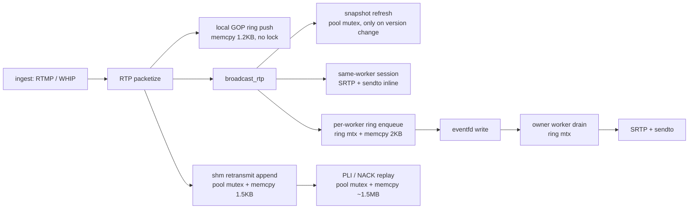

# 参照 SRS 的内存与调度优化建议（待评审）

> 状态：**待评审（RFC）**。本文件是提案与评审请求，不是已实现的设计。
> 配套阅读：`docs/architecture-review-vs-srs.md`（协议与数据面策略层差距）。本文补上
> 该文 §2 明确排除的「进程 / 线程 / 协程模型与内存管理」部分，并把范围扩大到音频线程、
> 会话内存生命周期与可观测性。
>
> **行号基准**：本文全部 `文件:行号` 引用已按 2026-09-10 16:46 的 `src/` 复核一遍
> （首稿普遍偏小 2–15 行）。本仓库有并发写入者，行号仍会漂移，评审时请按内容重定位；
> 宏与结构体尺寸引用不受影响。

## 1 结论

1. **我们的瓶颈不在协程。** SRS 的调度优势来自 ST 协程（每条连接一个可阻塞协程），
   我们是 nginx 事件循环 + 显式状态机，没有协程。因此 SRS 的调度经验只能翻译成三件事：
   **缩短全局锁持有时长、把发送突发从摄入口摘掉、减少固定预留内存**。
2. **重传环与注册表共用 slab 全局锁**（§4.1，严重度高但**量级待实测**）。只要存在一个跨
   worker 观众，之后每个视频包都在 `pool->mutex` 内 memcpy；每次 PLI 回放还在同一把锁内搬
   约 1.5MB。这把锁是所有 worker 的注册表锁。两条更正：按其自身的吞吐算术，append 那段的
   持锁占比约 0.004%，真正值得处理的只有回放的约 100µs；而且该锁**当前同时是环的生命周期
   保证**（`src/ngx_rtc_shm.h:46-47`），所以 4.1 不是纯性能改动，且按 nginx 惯例应做
   **单写者无锁发布**，不是「再加一把锁」。
3. **次高是同 worker 观众内联发送**（P1）。同 worker 的 SRTP 加密、EAGAIN 判定与
   加入时的 GOP 回放突发都跑在摄入口的事件循环上；跨 worker 反而被环解耦。
   同一路流的质量取决于观众被分到哪个 worker。
4. **每次回放 1.5MB 堆分配**（P1）应改为复用缓冲；这是纯抖动来源，与锁无关。
5. **不建议照搬 SRS 的 per-consumer 协程 + 阻塞队列**：nginx 事件循环里没有可阻塞的
   调度器，队列只会把丢包变成延迟。我们现有的「丢弃到下一个 IDR + pacer + NACK 预算」
   方向正确，应保留。

**动手顺序以 §8 为准，不以本节编号为准**：先做零风险、纯抖动的 4.3，再评估 4.1。本节的
编号表示严重度，§8 的表格表示实施次序 —— 首稿这两处口径不一致，此处统一。

## 2 评审范围

本文评审以下内容，请评审者逐项给出结论：

| 范围 | 具体内容 |
| --- | --- |
| 调度模型 | nginx 事件循环 vs SRS ST 协程；慢消费者隔离；突发（回放 / 重传）在哪条时间线上执行 |
| 锁分层 | `pool->mutex`（slab 全局）、`ring->mtx`（per-worker 媒体环）、音频 pthread mutex 三层的职责与竞争 |
| 内存布局 | 每源 / 每 worker / 每会话的固定预留；共享内存与进程内存的划分依据 |
| 分配热点 | 每包、每 PLI、每会话生命周期的 malloc / slab 分配 |
| 唤醒路径 | eventfd 唤醒放大；MPSC 环的入队/出队成对开销 |
| 状态一致性 | 每进程 session 与 shm 会话骨架「两份真相」的边界 |
| 音频通路 | 独立 pthread + vring 的内存与调度代价（转码 vs 透传不在本文范围） |
| 可观测性 | 上述各项是否可测量，缺哪些计数器 |

不在本文范围：协议正确性（RTP/SDP/STUN/DTLS/SRTP/RTCP 语义）、发行与部署、
Windows 兼容性。

## 3 事实基线

### 3.1 调度模型对照

| 维度 | SRS 6.0 | 本仓库 |
| --- | --- | --- |
| 并发原语 | ST 用户态协程，可阻塞（`st_cond_timedwait`） | 无协程；nginx 事件循环 + 显式状态机 |
| 线程/进程 | N 个 hybrid OS 线程，每个线程带自己的 epoll 与多个协程（`src/app/srs_app_threads.hpp`） | `worker_processes` 个进程，每进程单事件循环 |
| 每连接执行体 | 一个协程：`SrsRtcPlayStream::cycle()` 循环取自己的队列并发送（`src/app/srs_app_rtc_conn.cpp:640`） | 同一事件循环内的回调链（`ngx_rtc_stream_handler` / 定时器 / 环出队） |
| 慢消费者隔离 | 该 consumer 协程阻塞在 `consumer->wait()`，不影响他人 | 同 worker 内联发送 → 影响摄入口；跨 worker 经环解耦 |
| 跨执行体通信 | 共享对象 + 显式锁 | shm + eventfd + MPSC 环 |
| 队列与丢弃 | 每 consumer `std::vector<SrsRtpPacket*>`，丢弃在 sender 侧 | 每 worker 单环（MPSC）+ 发送侧丢弃策略 |
| 音频转码 | 独立线程 | 独立 pthread + vring（两者一致） |

关键差异：**SRS 用「阻塞」实现隔离，我们用「丢弃 + 环」实现隔离**。前者要求每条流有
自己的执行体，后者要求突发绝不落在共享时间线上——所以下面的 P1 不是可选项。

### 3.2 内存画像（64 位推导值）

单源（一路直播）在**发布者所在 worker** 的进程内存 + 共享内存占用：

| 结构 | 位置 | 容量 | 占用 |
| --- | --- | --- | --- |
| 本地 GOP 环 | 进程内 | `rtc_gop_ring_slots` 默认 2048 × 1218B | ≈ 2.5MB / 源 |
| shm 重传环 | 共享内存 | 1024 × 1504B（有跨 worker 观众时惰性分配） | ≈ 1.5MB / 源 |
| 上行 jitter 环 | 进程内 | 128 × 1218B（仅 WHIP 源） | ≈ 156KB / 源 |
| 音频 in/out arena | 进程内 | 16×(4+8192) + 16×(4+4000) | ≈ 195KB / 源 + 线程栈 |
| per-worker 媒体环 | 共享内存 | 512 × ≈2052B | ≈ 1.05MB / worker |
| 会话 | 进程堆 | session + cipher 缓冲 1256B | ≈ 2.5–3KB / 会话 |

推导依据：`NGX_RTC_MAX_RTP_PKT = 12 + 2 + 1200`（`src/ngx_rtc_rtp.h:65`）；
重传槽 `2 + 1 + 1500`（`src/ngx_rtc_shm.h:53-57`，容量见 `48`、`50`）；环条目
`seq/media/gop/len/nsess` 各 8B + `sess[64]×8B` + `rtp[1500]` = 2052B
（`src/ngx_rtc_shm.h:166-173`）；cipher `1214 + 10 + 32`（`src/ngx_rtc_core.h:44`）。

**这些是推导值，不是实测 sizeof。** 评审者应自行用 `sizeof`/`offsetof` 复核（见 §7 第 1 项）。

已发现的尺寸口径不一致（复核 §7-1 的部分结论，先记在此）：`ngx_rtc_rtp_cache_slot_t`
（`src/ngx_rtc_core.h:174-179`）实际字段是 `data[1214] + len(2) + is_gop_start(1)`，
按 2 字节对齐后 **sizeof = 1218**；首稿写的 1214 只算了载荷，漏掉 4 字节头。而
`src/ngx_rtc_core.h:155` 的注释又写「~1224 B/slot」，与两者都不符。三处应统一为
`sizeof` 实测值；对总量影响 <1%（2.49MB 对 2.51MB），结论不变。

对照：SRS 的 RTC ring 只存指针（每 consumer 100 / 1000 槽 × 8B ≈ 0.8–8KB，
`src/app/srs_app_rtc_source.cpp:2496`），包体由 `SrsRtpPacket` 按需堆分配并引用计数。
即：**SRS 按观众数付费，我们按源固定预留**。

### 3.3 数据面锁点

| 热点 | 锁 | 频率 | 锁内工作 |
| --- | --- | --- | --- |
| 视频包 append | `pool->mutex` | 每包（存在跨 worker 观众时） | memcpy ≤1500B + 槽元数据（`shm.c:1396-1400`） |
| GOP 回放 | `pool->mutex` | 每次 PLI / 回放 | memcpy 整段 GOP，≤1024×1504B（`shm.c:1507-1511`，解锁 `1512`） |
| 订阅快照刷新 | `pool->mutex` | 订阅集合变化时 | O(订阅数) 拷贝 |
| 会话 bind / activate / remove | `pool->mutex` | 会话生命周期 | 链表 + 少量字段 |
| 跨 worker 入队 | `ring->mtx` | 每包每目标 worker | memcpy ≤1500B + 会话 id 数组 |
| 环出队 | `ring->mtx` | 每条目 | memcpy 到栈 |
| 音频生产 / 消费 | pthread mutex | 每音频帧 | vring 写入 |

### 3.4 约束：nginx 与 RTMP 模块的特性

本文所有建议都受下面两条技术栈的约束；凡与之冲突的方案应直接否决，而不是留作备选。

| 特性 | 由此产生的约束 |
| --- | --- |
| nginx 是**多进程、每进程单事件循环**，进程间没有共享的可阻塞调度器 | 「阻塞等待另一个 worker」类方案不可用；跨 worker 只能靠 shm + 原子 + eventfd |
| nginx 的数据面**不持跨进程锁**；`ngx_shmtx` 历来只用于控制面（accept mutex、slab 池） | 数据面（每包、每回放）持全局 shm 锁本身就偏离惯例 —— 这才是 4.1 值得做的真正理由 |
| nginx 对「单写者、多读者」的既定做法是**版本号发布 + 读侧重试** | 本仓库已在用（`subscribers_version` / `snap_version`，`src/ngx_rtmp_rtc_bridge_module.c:1075-1083`）；重传环应走同一套路，而不是再加一把锁 |
| 单次事件循环迭代**必须有界**；重活要切到定时器 / 延后队列（`ngx_add_timer` / `ngx_post_event`） | 这是 4.2 分片回放方案的依据，也是 4.2 方案 1（同 worker 绕一趟 shm）不讨好的原因 |
| RTMP 模块中**一路流恒属单一 worker**（publisher 所在进程固定，跨 worker 无 RTMP） | 重传环的 append 是**单写者**，本质上不需要互斥 —— 这是 4.1 能无锁化的前提 |
| slab 池内存**不还给 OS**，且没有跨 worker 的回收协议 | 释放是 4.1 无锁化真正的难点（见 4.1 的代价与风险），不是附带项 |

## 4 问题清单

### 4.1 P0 重传环共用 slab 全局锁

**现象**：重传环的读写全部走 `pool->mutex`。append 仅在 `remote_subscribers == 0`
时无锁返回（`src/ngx_rtc_shm.c:1365`），一旦有跨 worker 观众，**每个视频包**都取一次
全局锁并 memcpy ≤1500B（`src/ngx_rtc_shm.c:1396-1400`）。回放更严重：锁内把最多 1024
个槽整段 memcpy 出来（`src/ngx_rtc_shm.c:1507-1511`，解锁在 `1512`）。

**影响（量级待实测，见 §7-2）**：`pool->mutex` 同时服务注册表（source/session 的增删查、
会话 bind/activate、订阅快照）。但两段锁内工作的量级差两个数量级：

| 锁内工作 | 数据量 | 量级 | 频率 |
| --- | --- | --- | --- |
| append memcpy | ≤1500B | 百纳秒 | 4Mbps / 1200B ≈ 420 包/秒 |
| replay memcpy | ≤1024×1504B | 约百微秒 | 每次 PLI / 观众加入 |

按此估算 append 的持锁占比约 0.004%，**不是**「每包都在争锁」；真正值得处理的是 replay
那约 100µs。若实测证实，§1 的 P0 定级应下调，或改述为「PLI 突发时池锁被占约 100µs」。

**建议（按 nginx 惯例，而不是「再加一把锁」）**：本环的写入者**只有一个进程**——
发布者所在 worker（`append` 只在该 worker 的摄入口被调用，RTMP 侧一路流恒属单一 worker）。
也就是说它是 **SPSC（单生产者多消费者）**，本质上不需要互斥；**再加一把 `ngx_shmtx_t`
只是把争用换个地方，并不能消除它**，反而会破坏下面那条生命周期契约。

nginx 自身对「单写者、多读者」的做法是**版本号发布**，本仓库已经在用同一套路
（`subscribers_version` / `snap_version` 免锁快照，`src/ngx_rtmp_rtc_bridge_module.c:1075-1083`）：

1. `head` / `gop_start` 用 `ngx_atomic_t` 发布：写侧先填槽，再以 release 语义更新 `head`。
   （`src/ngx_rtc_shm.h:169` 的 `seq` 字段注释「monotonic slot sequence (future lock-free)」
   已经预留了这个方向。）
2. 读侧先读 `head`，读槽，再复读 `head` 确认未跨代；跨代则重试。
3. replay 因此不需要「分块取锁」，按一次 `head` 快照读完即可，天然无锁。

**代价与风险（这是硬约束，不是实现细节）**：`pool->mutex` 目前同时承担环的**生命周期**
保证，不只是数据一致性。`src/ngx_rtc_shm.h:46-47` 原文：

> All slots are read/written under the slab pool mutex, **so a ring is never read
> after its source is freed.**

释放侧在同一把锁下 `ngx_slab_free_locked(ctx->pool, src->retransmit)`
（`src/ngx_rtc_shm.c:503`、`src/ngx_rtc_shm.c:1225`）。一旦读侧改成无锁，读侧持指针期间
释放侧就能 free 掉这块 slab —— **这是一个 use-after-free 窗口**。首稿把它降级成
「销毁顺序需要与锁创建配对」，低估了。无锁化必须同时给出释放侧的等待机制，二选一：

- **引用计数 / epoch 延迟释放（推荐）**：释放侧先摘链，等一个宽限期（例如一个 reap 周期）
  再 free；代价是一个 `ngx_atomic_t` 读者计数加一次延迟。nginx 内部对这类「读侧无锁、
  写侧回收」用的就是这个形状。
- **永不释放、只复用**：nginx 的 slab 池本就不还给 OS，source 重建时复用同一块环。

**这是 4.1 的前置条件，不是可选项。**

### 4.2 P1 同 worker 观众在摄入口的时间线上

**现象**：`ngx_rtc_broadcast_rtp` 对 `snap_slots[i] == ngx_worker` 的观众直接内联
`send_rtp`（`src/ngx_rtmp_rtc_bridge_module.c:1091-1101`）；仅跨 worker 目标走环 + eventfd。
同 worker 观众在 DTLS 完成时的 GOP 回放同样在该 worker 上执行，一次最多 2048 包
（`NGX_RTC_GOP_RING_CAP`，`src/ngx_rtc_core.h:156`）。

**影响**：同 worker 观众的 SRTP 加密、EAGAIN 判定、回放突发都占用摄入口时间线；
观众落在哪个 worker 会改变流的质量与首帧时间（与跨 worker 首帧问题同源）。

**建议（二选一，评审定）**。按 nginx 惯例，方案 2 更贴合：nginx 处理「单次事件循环迭代
工作过重」的标准手段就是**切到定时器/延后队列**（`ngx_add_timer` / `ngx_post_event`），
而不是加一次跨进程搬运。

1. 同 worker 也统一走 per-worker 环，广播只负责入队（路径统一，代价是多一次
   memcpy + 锁 + eventfd 唤醒）。**注意**：同 worker 是唯一能完全走进程内路径的场景，
   为一它引入 shm 环 + eventfd，等于把进程内问题跨进程化，与 nginx 的取向相反。
2. 保留内联，但回放分片：每次最多 K 包（如 64），用 0ms 定时器续发，保证单次
   事件循环迭代有界。**推荐**，与 `ngx_rtc_stream_replay_gop` 现有实现形状兼容
   （`src/ngx_rtc_stream_module.c:1382`）。

**代价与风险**：方案 1 会削弱同 worker 的「无锁本地环」快路径（NACK/PLI 仍读本地环，
但实时发送多一次拷贝）；方案 2 需要保证分片期间 GOP 的完整性与顺序。

### 4.3 P1 每次回放分配 1.5MB

**现象**：`ngx_rtc_shm_retransmit_replay_gop` 每次调用都
`ngx_alloc(NGX_RTC_SHM_RETX_RING_CAP * sizeof(slot))` 再 `ngx_free`
（`src/ngx_rtc_shm.c:1483-1484`，释放见 `1522`）。此前的改动只是把分配移出锁外，
分配本身仍在。

**影响**：每个观众加入触发一次（PLI），100 个观众即 100 次 1.5MB 分配 + 缺页 + 拷贝，
是明确的内存抖动源。

**建议**：改为 per-worker 复用缓冲（worker 级缓存，容量固定为环容量），或按块拷贝到
栈上小缓冲。**注**：若 4.1 按「版本号发布 + 无锁读」实现，则读侧只需持一个 `head`
快照遍历环本身，这块 1.5MB 中转缓冲**整个消失**，本条与 4.1 应合并处理，不要分别做两遍。

### 4.4 P2 GOP 环与 shm 环双份预留

**现象**：本地 GOP 环默认 2048 槽 ≈2.5MB/源（已可配：`rtc_gop_ring_slots`，
`src/ngx_rtc_shm.c:109`），shm 重传环 1024 槽 ≈1.5MB/源。同一段视频在两处各存一份。

**建议**：评估在 shm 环存在时把本地环降级（例如只保留 IDR 起点索引），或把默认容量
下调并给出按码率推导的配置建议。**注意**：本地环承担同 worker 的无锁 NACK/PLI 快路径，
不能简单删除，需与 4.2 的方案一起决策。

### 4.5 P2 跨 worker 扇出静默截断

**现象**：`broadcast_rtp` 通过 `NGX_RTC_SOURCE_MAX_SNAPSHOT = 256` 取订阅快照
（`src/ngx_rtc_core.h:134`）。快照按订阅队列的**插入序**取前 256 个（`src/ngx_rtc_shm.c:1270-1278`
的 `n < max` 提前退出），没有计数与告警。

**影响**：比「部分观众黑屏」更确定 —— 因为遍历是插入序且提前退出，**先订阅的 256 个
恒赢，第 257 个起永远进不了任何一次快照刷新**（刷新不会改变队列顺序）。所以受影响的
是一组固定会话，而不是随机抽查；压测时表现为「固定几个观众永远黑屏」，排查成本高。

**建议**：溢出时记一次 warn + 累加计数器（最小改动）；或把订阅集合改为 shm 内按需扩展。

### 4.6 P3 eventfd 唤醒放大

**现象**：每个视频包对每个目标 worker 写一次 eventfd
（`src/ngx_rtmp_rtc_bridge_module.c:1130-1131`）。

**建议**：只在环由空转非空时写（用 `ngx_atomic_fetch_add` 的返回值判断），
把唤醒次数压到每个排空周期一次。属于低风险微优化，可作为独立小改动。

### 4.7 P3 会话的「两份真相」

**现象**：每个逻辑会话有进程内 `ngx_rtc_session_t`（含 FSM、SRTP、连接）与 shm 骨架
（`srtp_ready` / `owner_slot` / `close_requested`）。信令 worker 的副本会一直停在
`NEW` 直到被回收，见 `docs/ARCHITECTURE.md` 的会话状态机条目。

**风险**：任何跨 worker 的查询若读了进程内 FSM，会得到与全局不一致的答案。

**建议**：明确「进程内 FSM 只回答本进程，全局就绪看 shm `srtp_ready`」这一契约，
并在统计接口与文档中固化（已在 ARCHITECTURE.md 记录，评审确认是否足够）。

## 5 不建议照搬 SRS 的部分

| SRS 机制 | 为什么不照搬 |
| --- | --- |
| 每 consumer 协程 + 阻塞队列 | nginx 事件循环没有可阻塞调度器；引入即把丢包变成排队延迟，与低延迟目标冲突 |
| 每 consumer 独立 ring | 若照搬成**整包** per-consumer ring，内存由「≈4MB/源」变成「≈1.5MB × 观众数」，与我们的共享环取向相反。注意 SRS 本体只存指针（见 §3.2），代价不在这里 —— 这一行比较的是「我们照搬后的形状」，不是 SRS 的开销 |
| `SrsMessageQueue` 按时间限长丢 GOP | 那是 RTMP 域机制；RTC 域应继续用发送侧丢弃 |
| 无上限的 consumer vector | 需要配合发送侧丢弃与内存审计，否则大观众量下不可控 |

## 6 待评审的开放问题

1. **4.1 的锁拆分是否值得**：拆环锁带来锁序复杂度，收益是消除每包全局锁。是否存在
   更简单的替代（如 append 走「环形原子头 + 单写者」无锁写）？
2. **4.2 选方案 1 还是 2**：统一入环会牺牲同 worker 快路径；分片回放引入定时器
   状态。哪条对首帧与 p99 更有利？需要数据支撑。
3. **4.4 本地环能否降级**：同 worker 的 NACK/PLI 是否必须无锁？若可接受环锁，
   两份缓存可以合并为一份。
4. **默认容量是否合理**：2048 槽 GOP 环在 4Mbps / 30fps 下的实际覆盖时长是否需要
   按码率自适应？
5. **音频线程是否值得保留独立 pthread**：SRS 亦用独立线程，但如果转码需求消失
   （透传 Opus），这套线程 + vring + mutex 是否应整体移除？
6. **P0/P1 的先后**：若只能做一件，是否应先做 4.3（零风险、纯抖动）再评估 4.1？

## 7 评审清单（逐项需给出 PASS/FAIL 与证据）

| # | 检查项 | 需要的证据 | PASS 判定 |
| --- | --- | --- | --- |
| 1 | §3.2 内存数字是否属实 | 用 `sizeof`/`offsetof` 实测替代推导，给出命令与输出 | 偏差 ≤10% 或文档已更正 |
| 2 | 「有跨 worker 观众时每包持全局锁」是否属实 | 代码路径 + 计数器（append 进入锁的次数/秒） | 结论与代码一致，且给出实测频率 |
| 3 | 回放锁内拷贝能否分块而不破坏一致性 | 环的代数/`gop_start`/`count` 语义分析 | 证明分块期间不会读到跨代数数据 |
| 4 | 拆环锁是否引入死锁或锁序反转 | 全部持锁点清单（`pool->mutex` 与 `ring mtx` 交叉处） | 无反向获取，且有注释固定锁序 |
| 5 | 同 worker 入环是否造成性能回退 | 同 worker 观众场景下的单包耗时对比（改前/改后） | 回退可量化且被评估接受 |
| 6 | 回放分片是否破坏首帧完整性 | 分片期间的发送顺序与 IDR 边界论证 | 仍然从 IDR 起连续输出 |
| 7 | §4.5 的 256 截断是否真实可复现 | 复现步骤（或说明为何不可达） | 结论可复现或文档移除该结论 |
| 8 | 是否引入过度设计 | 对照 `AGENTS.md` 禁止范式（helper/抽象层/新文件） | 无新增抽象层，改动可追溯到单条需求 |
| 9 | 是否与既有文档冲突 | 与 `video-retransmit-cache-design.md`「消除每会话缓存」对照 | 不引入每会话缓存 |
| 10 | 是否保住纯 C 核心边界 | `src/ngx_rtc_hsm*.c` / `session_fsm` 仍只依赖 libc | 未引入 nginx 头到纯 C 单元 |

**评审输出要求**：结论先行；每条给 PASS/FAIL 与一行理由；引用 `文件:行号`；
若判定 FAIL，给出最小修复建议（不要求完整补丁）。禁止在本轮评审中直接改代码。

## 8 建议实施顺序与回滚

顺序以 §9 的实测为前提：第 0 步之前下面每一条的风险与收益都只是估计。

| 顺序 | 改动 | 风险 | 回滚方式 |
| --- | --- | --- | --- |
| 0 | §9 埋点（append / replay 的计数与计时） | 极低 | 关掉即消失，不改任何行为 |
| 1 | 4.5 扇出截断计数 + warn | 低 | 单点回退 |
| 2 | 4.6 eventfd 空转非空才唤醒 | 低 | 单点回退 |
| 3 | 4.1 单写者无锁发布 + 延迟释放，4.3 随之合并 | 中 | 保留现有 `pool->mutex` 路径作为过渡 |
| 4 | 4.2 回放分片（方案 2；方案 1 已否决） | 中高 | 配置开关切换回内联 |
| 5 | 4.4 容量优化 | 中 | 配置回退默认值 |

两处与首稿的差异，评审时请注意：

- **4.3 不再是独立一步，并入 4.1。** 若 4.1 按 §4.1 的方案实现（读侧按一次 `head`
  快照读完），那块 1.5MB 中转缓冲整个消失；先单独做 4.3 等于做一遍再拆掉。
- **4.1 不再是「独立锁 + 分块回放」。** §4.1 已否决这两个做法：再加一把锁只是把争用
  换个地方，且会破坏环的生命周期契约（见 §4.1 的「代价与风险」）。改为单写者无锁发布
  加读侧重试，且释放侧必须同时给出延迟释放机制 —— 那是前置条件，不是可选项。

原则：每一步独立可验证、独立可回退；不与协议层改动混在同一批。

## 9 验证方案

改动前后各测一轮，指标与测法：

| 指标 | 测法 |
| --- | --- |
| append 持锁频率与耗时 | **已埋点**：`/rtc/v1/stats` 的 `total_retx_lock.append_locked` / `append_us`（每源另有同名字段）。推流 60s 后读一次、再等 60s 读一次，取增量除以时长即得「次/秒」与「锁上耗时占比」 |
| 回放耗时与分配次数 | **已埋点**：同处的 `replay_count` / `replay_slots` / `replay_us`。`replay_count` 即分配次数（每次回放必分配一次 1.5MB）；`replay_slots / replay_count` 是平均 GOP 槽数，乘 1504B 即平均拷贝量；`replay_us / replay_count` 是平均单次损失。4.3 做完后 `replay_count` 应不再增长即分配次数为 0 |
| 摄入口事件循环单次迭代耗时 | 发布 worker 上统计「一次 RTP 广播 + 全部同 worker 发送」的耗时分布（p50/p99） |
| 首帧时间 | 观众 DTLS 完成 → 第一个视频包发出；同 worker 与跨 worker 分别统计 |
| 端到端延迟 | 现有 `/rtc/v1/stats` 与 TWCC 计数（`twcc_lost` / `twcc_received`） |
| 规模 | 单源 N 个观众（N=1/50/200/300），观察扇出截断与内存占用 |

两个 `_us` 字段量的是**从加锁前到解锁前**——即锁等待加上锁内工作，而不是只有拷贝。要回答的
问题是发布者在这把锁上损失多少时间，等待就是成本本身。它们随源存活累积（源被回收重建即归零），
所以只读增量，不要读绝对值。计数器全部在持锁期内写、也在持锁期内读（`/rtc/v1/stats` 走同一把
`pool->mutex`），因此不需要原子操作。

场景矩阵：2 worker × {1 同 worker 观众, 1 跨 worker 观众, 两者同时} × {无丢包, 人为丢包}。

## 10 参考

- `references/srs-server-6.0-r1/trunk/src/app/srs_app_rtc_conn.cpp`（`SrsRtcPlayStream::cycle`）
- `references/srs-server-6.0-r1/trunk/src/app/srs_app_rtc_source.cpp`（consumer / ring 容量）
- `references/srs-server-6.0-r1/trunk/src/app/srs_app_rtc_queue.cpp`（`SrsRtpRingBuffer`）
- `references/srs-server-6.0-r1/trunk/src/app/srs_app_threads.hpp`（hybrid 线程池）
- `docs/architecture-review-vs-srs.md`、`docs/video-retransmit-cache-design.md`、
  `docs/ARCHITECTURE.md`
