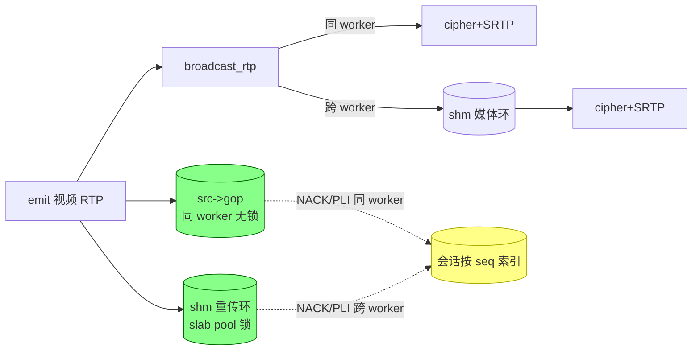

# 视频重传缓存合并:每流一份,按序号索引

## 结论

把视频明文 RTP 的重传缓存从「每会话一份 RTX 环」收敛为「每个 source 一份权威缓存」,
所有会话按 RTP 序号索引引用。同 worker 会话读进程内 GOP 环(无锁),跨 worker 会话读 shm
重传环(slab pool 锁)。消除每会话约 1.5 MB 明文拷贝;单 worker(无跨 worker viewer)热路径
回到每包 1 次 memcpy。

## 现状:同一个包存了两份

视频数据通路里,同一个 plaintext RTP 包被缓存两份:

- 源级 `src->gop`(进程内 GOP 环,发布者 worker)
- 会话级 `sess->rtx`(每会话 RTX 环,1024 slots ≈ 1.5 MB/会话)

`ngx_rtc_broadcast_rtp` 同 worker 路径对每个视频包先 `rtx_push`(拷入 `sess->rtx`)
再 `send_rtp`(拷入 `sess->cipher` + SRTP);跨 worker 路径经 shm 媒体环投递到 owner
worker 后再 `rtx_push` 一次。`sess->rtx` 存在的唯一理由是「跨 worker 时源 GOP 环不在
本进程」,但同 worker 会话其实可以直接读 `src->gop`,这份拷贝是纯冗余。

## 目标设计

两个物理缓存(各自必要,非冗余):

- **进程内 GOP 环 `src->gop`**:发布者 worker 上,服务同 worker 会话,无锁。
- **shm 重传环**(每 source,替换原有「关键帧快照」):服务跨 worker 会话。环槽读写与释放
  统一在 slab pool 锁下:锁同时保护「内容」与「生命周期」,避免读方持裸指针时被
  `source_remove` 并发 free。

会话侧移除 `sess->rtx` 整环,改为 per-session NACK 去重数组 `nack_seen[]`(窗口内已重传
seq,预算 128,替代原 `slot->rtx_gen`)。



### 重传读哪个环

规则是「源环有数据读源环,否则读 shm 环」,落到 `ngx_rtc_source_gop_ready()`:

```c
int ngx_rtc_source_gop_ready(const ngx_rtc_source_t *src)
{
    return (NULL != src && NULL != src->gop.slots && 0 != src->gop.count) ? 1 : 0;
}
```

这只是「非空」判断:publisher 重启、环尚未 reserve、或跨 worker 的源在本地没有
`src->gop` 时,会误判为无数据而走 shm 环。走错不影响正确性,两个环都按 RTP 序号定位并
校验命中:

- 进程内 `ngx_rtc_rtp_ring_get` 与 shm `ngx_rtc_shm_retransmit_get` 都先算
  `dist = (rtp_seq - start_seq) & 0xffff`,再验证槽位里的 RTP seq 与请求一致,
  不一致即 miss。
- 16-bit 模距离在窗口跨越回绕点时依然正确,前提是环容量(1024) << 65536,即序号距离
  在窗口内唯一。

### 音频不缓存

音频 seq 与视频 seq 是两套独立计数器,混入同一按 seq 索引的环会破坏 NACK 定位;音频是
连续直播流,也不需要 fast-start 回放。音频 NACK 在收包路径被 media_ssrc 过滤直接忽略
(见 `ngx_rtc_stream_rtcp_cb` 的注释)。

## 用固定窗口,不用引用计数

阻塞式引用计数(槽位等所有会话消费完才回收)不可取:一个卡顿或暂停的 viewer 会拖住
整条环无法前进,头部阻塞直接抬高延迟,与低延迟直播矛盾。做法是固定窗口 + 序号游标:

- 环容量固定(≥ NACK 窗口 + 一个 GOP),所有会话同步消费直播流,固定窗口覆盖所有人的
  重传需求。
- 按 RTP 序号 O(1) 定位,不维护 per-slot 原子计数。环槽读写/释放统一持 slab pool 锁;
  读路径(NACK/PLI/fast-start)与 append(每视频包 1 次)都是低频操作,pool 锁争用可忽略。
  上一版的 per-ring `ngx_shmtx_t` 是过度设计:内容锁挡不住 `source_remove` 的 free,反而
  引入 use-after-free,故回退为单锁。
- 落后 viewer 需要的旧包被自然淘汰,由 NACK/PLI 兜底,而不是让它阻塞整条环。

### 已知代价

- **`replay_gop` 回放期分配堆缓冲**:堆缓冲在 pool 锁外分配(≤ cap×slot ≈ 1.5 MB),锁内把
  整段 GOP 拷出,放锁后逐包发送;慢 viewer 的阻塞 `sendto` 不阻塞发布者 `append`。代价是每次
  回放一次堆分配,但只发生在 fast-start/PLI(低频),且缓冲在函数内释放。
- **分配失败按包重试**:zone 耗尽时 `append` 对每包重试一次 lazy alloc 并持 pool 锁,失败
  计入 `retransmit_alloc_failed`(stats 可见)。保留重试是权衡:zone 空间会随其他流结束而
  释放,环可自愈;日志只在首次失败时打一条,防止 zone 饥饿时按包速率刷 error log。
- **首个跨 worker viewer 不即时 fast-start**:append 按 `remote_subscribers > 0` 门控,该
  viewer 订阅前环为空,首帧要等下一个 IDR(≤1 GOP);后续跨 worker viewer 环已预热,不受影响。

以下性能/内存开放项来自 `docs/archive/srs-memory-scheduling-optimization.md` §4 的 2026-09-11
状态复核,行号已按当前 `src/` 重新核实;已落地的部分一并注明,未落地前不应视为已解决。

- **4.1(P0,PARTIAL)重传环共用 slab 全局锁**:单写者无锁发布与延迟释放均未落地——`head`/
  `count`/`gop_start` 仍是普通 `ngx_uint_t`、由 `pool->mutex` 保护(`src/ngx_rtc_shm.h:72-74`),
  释放侧仍在同一把锁下 `ngx_slab_free_locked`(`src/ngx_rtc_shm.c:164`、`src/ngx_rtc_shm.c:994`),
  无读者计数或 epoch。已落地部分:`append` 接收发布者缓存的 `shm_src` 指针、锁内不再按名查
  rbtree(`src/ngx_rtc_shm.c:1133`、`src/ngx_rtc_shm.h:472-475`),`0 == src->remote_subscribers`
  时完全跳过锁(`src/ngx_rtc_shm.c:1153`),回放的 ~1.5MB 缓冲分配已移出锁外
  (`src/ngx_rtc_shm.c:1280-1286`)。核心现象未变:有跨 worker viewer 时每个视频包仍持全局锁
  memcpy,回放仍在锁内整段拷贝。原评审据自身算术估计 `append` 持锁占比约 0.004%、真正值得处理
  的是回放约 100µs,该量级仍待实测(stats 已埋点 `total_retx_lock.append_locked`/`append_us`
  与 `replay_count`/`replay_slots`/`replay_us`)。
- **4.2(P1,OPEN)同 worker 观众在摄入口时间线上**:广播对同 worker 观众仍内联
  `ngx_rtc_session_send_rtp`(`src/ngx_rtmp_rtc_bridge_module.c:1127-1133`);DTLS 完成时的
  GOP 回放仍是同步循环(`src/ngx_rtc_core.c:826-880`),未采用 0ms 定时器分片。该函数注释明确
  反对分片:定时器会让旧 GOP 包与直播包交错,RTP 序号乱序反而破坏解码(`src/ngx_rtc_core.c:842`),
  故原「方案 2」与现有实现形状的兼容性需重评。
- **4.3(P1,OPEN)每次回放分配 1.5MB**:`ngx_rtc_shm_retransmit_replay_gop` 仍每次
  `ngx_alloc(NGX_RTC_SHM_RETX_RING_CAP * sizeof(slot))`(`src/ngx_rtc_shm.c:1283-1284`),
  `ngx_free` 在 `src/ngx_rtc_shm.c:1365`;分配已在锁外(`src/ngx_rtc_shm.c:1290` 才加锁),
  但未改为 per-worker 复用缓冲。若 4.1 按版本号发布 + 无锁读实现,这块中转缓冲会整体消失,
  故 4.3 应与 4.1 合并处理。
- **4.4(P2,OPEN)GOP 环与 shm 环双份预留**:两份缓存都在——进程内 `src->gop`
  (`src/ngx_rtc_core.h:388`,默认 `NGX_RTC_GOP_RING_CAP=2048`,`src/ngx_rtc_core.h:164`)与
  shm `src->retransmit`(`src/ngx_rtc_shm.h:127`,`NGX_RTC_SHM_RETX_RING_CAP=1024`,
  `src/ngx_rtc_shm.h:60`),容量未下调或自适应。本地环承担同 worker 无锁 NACK/PLI 快路径,
  不能简单删除,需与 4.2 一起决策。
- **4.5(P2,OPEN)跨 worker 扇出静默截断**:订阅快照仍按插入序遍历、`n < max` 提前退出,无 warn
  与计数器(`src/ngx_rtc_shm.c:1039-1041`);另有同源静默截断:每 worker 最多携带
  `NGX_RTC_RING_MAX_SESSIONS=64` 个 session id(`src/ngx_rtc_shm.h:61`、
  `src/ngx_rtmp_rtc_bridge_module.c:1142-1145`)。
- **4.6(P3,OPEN)eventfd 唤醒放大**:仍对每个目标 worker 每包写一次 eventfd
  (`src/ngx_rtmp_rtc_bridge_module.c:1154-1163`),无「空转非空」判断。
- **4.7(P3,PARTIAL)会话的「两份真相」**:契约「进程内 FSM 只回答本进程,全局就绪看 shm
  `srtp_ready`」已固化(见 `docs/ARCHITECTURE.md` 会话状态机条目),shm 会话骨架发布了只读
  `state` 字段供 stats 读取(`src/ngx_rtc_shm.h:176-183`);每进程一份 FSM 与 shm 骨架并存的
  「两份真相」是既定设计,结构未改。

## 内存占用

- 每 source shm 重传环 = `NGX_RTC_SHM_RETX_RING_CAP(1024) × ~1504 B ≈ 1.5 MB`。
  `rtc_zone 32m` 再叠加 per-worker 媒体环后,多分辨率 5 档并发时不足;多源部署应将
  zone 提到 64m 起步,或把 `NGX_RTC_SHM_RETX_RING_CAP` 降到 512(NACK 窗口只需覆盖 ~1 s)。
  当前保留 1024 以兜住完整 GOP 回放,容量约束在部署侧解决。
- 热路径拷贝账目:原来每视频包 `1 + Nsess` 次 memcpy(源环 + 每会话 rtx)。现在 `src->gop`
  push 恒 1 次;shm append 按需——`remote_subscribers == 0`(无跨 worker viewer)时跳过,
  只有存在跨 worker viewer 才多 1 次。单 worker 部署回到 1 次,多 worker 且有跨 worker
  viewer 时为 2 次。会话越多省得越多。

## 实现状态

已落地(全部编译通过,host 145/145,e2e PASS):

- `src/ngx_rtc_core.h/.c`:删除 `sess->rtx`/`rtx_gen` 与 5 个 rtx 函数;新增
  `ngx_rtc_session_retransmit` / `ngx_rtc_session_retransmit_send` /
  `ngx_rtc_session_nack_reset` / `ngx_rtc_source_gop_ready`;per-session 去重
  `nack_seen[NGX_RTC_NACK_BUDGET]`。
- `src/ngx_rtc_shm.h/.c`:新增 per-source 重传环,四个 API
  `retransmit_reset/append/get/replay_gop`,删除 `gop_snapshot_*`;环槽读写/释放统一在 slab
  pool 锁下(修 use-after-free);`append` 直接接收发布者缓存的 `shm_src` 指针,锁内不再按名查
  rbtree,并以 `remote_subscribers` 门控(无跨 worker viewer 时完全跳过 pool 锁,修单 viewer
  1→2 memcpy 回归);重传环只由 `ngx_rtc_shm_expire_locked` 与 `ngx_rtc_shm_source_remove`
  两处 free,两处都先过 `ngx_rtc_shm_source_referenced_locked()`(`session_free_locked` 不再
  free source,只补 `expires` 宽限)——既修泄漏也修跨 worker 裸指针的 use-after-free。
- `src/ngx_rtc_shm.c`:reaper 增加发布者心跳判定。发布源的 `publisher_seen_ms` 静默超过
  `NGX_RTC_SHM_PUBLISH_GRACE_MS`(10000ms)即视为发布者已死并回收;崩溃的 worker 不会执行
  `ngx_rtc_publish_release()`,否则该 source 及其 ~1.5MB 重传环会被钉到整个 zone 生命周期。
- `src/ngx_rtmp_rtc_bridge_module.c`:broadcast 去 `rtx_push`;emit 镜像到 shm 环;
  AVC 序列头重置源环 + shm 环(防重推流 seq 回绕误命中)。
- `src/ngx_rtc_stream_module.c`:NACK/PLI/fast-start 统一走 `ngx_rtc_stream_retransmit` /
  `ngx_rtc_stream_replay_gop`;WHIP 收包补 `src->gop` push,并经
  `ngx_rtc_stream_shm_source()` 缓存 `shm_src`(每 `NGX_RTC_SHM_SYNC_MS` 复核一次,不再每包
  按名重解析);drain/close 去 rtx 残留。
- `src/ngx_rtc_core.h`:源 `video_body`/`audio_body` 用匿名 union 复用一块 scratch
  (pipeline 数据结构复用)。
- `src/ngx_rtc_http_module.c`:stats 新增 `retransmit_alloc_failed` 计数。

## 文件清单

- `src/ngx_rtc_core.h` / `src/ngx_rtc_core.c` — 去 per-session 环,加去重 + 源环优先重传。
- `src/ngx_rtc_shm.h` / `src/ngx_rtc_shm.c` — shm 重传环(slab pool 单锁)+ 按需镜像门控。
- `src/ngx_rtmp_rtc_bridge_module.c` — broadcast 去 rtx_push、镜像到 shm 环。
- `src/ngx_rtc_stream_module.c` — NACK/PLI/fast-start 路由、drain_ring、去 rtx 残留。
- `src/ngx_rtc_http_module.c` — stats 计数。
- `test/test_rtc_core.c` — 重传/去重用例适配。

## 验证

- **host 单测**:`make -C test test` 全绿 145/145;`-Wall -Wextra -Werror` 无告警。
- **reset 后新流首包单测**:`ring_reset_serves_only_new_generation`(test_rtc_core.c)。
  老代包推至 seq 回绕点、按重推流语义 reset(count/gop_start 清零)、再推新生代,断言
  老 seq 全 miss、新 seq 命中、replay 只出新生代 GOP。shm `retransmit_reset`
  (head/count/gop_start 清零)与其语义一致。shm 层已进 host 构建(`test/Makefile` 编译
  `ngx_rtc_shm.c`):`test_shm.c` 覆盖注册表、源/会话生命周期、reaper 心跳回收与
  `referenced_locked` 拒释放;shm 重传环的 append/get/replay 仍由 e2e 覆盖。
- **全量编译**:`NGX_RTC_MODULE_SRC=<repo> NGX_RTC_THIRD=<third> scripts/build-openresty.sh`
  0 error。
- **e2e**:`./run.sh nginx` + `./run.sh keep-push` + `./run.sh verify`,断言首帧 < 1s、
  音视频均收包、`ring_drops=0`、`retransmit_alloc_failed=0`。
- **多 worker 路由**:worker_processes ≥ 2,同 worker viewer 与跨 worker viewer 各一,
  丢包脚本触发双边 NACK,断言两环各自按 seq 命中。
