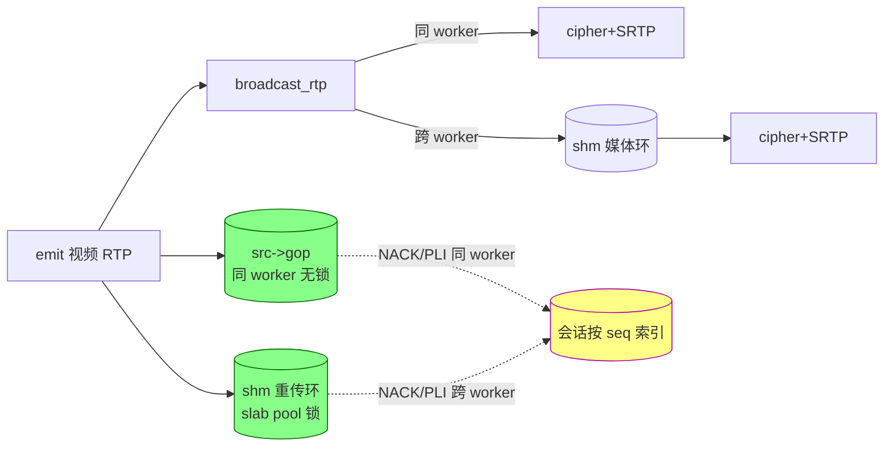

# 视频重传缓存：每 source 一份,按序号索引

## 结论

视频明文 RTP 的重传缓存是**每个 source 一份权威缓存**,所有会话按 RTP 序号索引引用。
同 worker 会话读进程内 GOP 环(无锁),跨 worker 会话读 shm 重传环(slab pool 锁)。
没有 per-session 的 RTX 环,因此没有每会话约 1.5 MB 的明文拷贝。

## 设计

两个物理缓存,各自必要、不冗余:

- **进程内 GOP 环 `src->gop`**:在发布者 worker 上,服务同 worker 会话,无锁。
- **shm 重传环**(每 source):服务跨 worker 会话。环槽的读写与释放统一在 slab pool 锁下——
  同一把锁既保护「内容」也保护「生命周期」,读方不可能持裸指针时被 `source_remove` 并发 free。

会话侧不存环,只有 per-session NACK 去重数组 `nack_seen[]`(窗口内已重传的 seq,
预算 `NGX_RTC_NACK_BUDGET`)。

### 重传读哪个环

规则是「源环有数据读源环,否则读 shm 环」,判据是 `ngx_rtc_source_gop_ready()`——它只判断
源环**非空**,所以 publisher 重启、环尚未 reserve、或跨 worker 的源在本地没有 `src->gop` 时,
会走 shm 环。走错不影响正确性,两个环都按 RTP 序号定位并校验命中:

- `ngx_rtc_rtp_ring_get` 与 `ngx_rtc_shm_retransmit_get` 都先算
  `dist = (rtp_seq - start_seq) & 0xffff`,再验证槽位里的 RTP seq 与请求一致,不一致即 miss。
- 16-bit 模距离在窗口跨越回绕点时依然正确,前提是环容量(1024)远小于 65536,即序号距离在
  窗口内唯一。

### 音频不缓存

音频 seq 与视频 seq 是两套独立计数器,混入同一个按 seq 索引的环会破坏 NACK 定位;
音频是连续直播流,也不需要 fast-start 回放。音频 NACK 在收包路径按 `media_ssrc` 过滤后忽略。

## 为什么用固定窗口,不用引用计数

阻塞式引用计数(槽位等所有会话消费完才回收)不可取:一个卡顿或暂停的 viewer 会拖住整条环
无法前进,头部阻塞直接抬高延迟,与低延迟直播矛盾。做法是固定窗口 + 序号游标:

- 环容量固定(≥ NACK 窗口 + 一个 GOP),所有会话同步消费直播流,固定窗口覆盖所有人的重传需求。
- 按 RTP 序号 O(1) 定位,不维护 per-slot 原子计数。
- 落后 viewer 需要的旧包被自然淘汰,由 NACK/PLI 兜底,而不是让它阻塞整条环。
- **不给环加私有锁**:内容锁挡不住 `source_remove` 的 free,反而引入 use-after-free,
  所以统一用 slab pool 锁。

### 已知代价

- **回放期分配中转缓冲**:堆缓冲在 pool 锁外分配(≤ cap × slot ≈ 1.5 MB),锁内把**关键帧
  access unit** 拷出,放锁后逐包发送,慢 viewer 的阻塞 `sendto` 不阻塞发布者 `append`。
  锁内只拷到 access unit 结束——发送循环本就停在 RTP marker 位,其后的槽不会被任何人发出。
- **分配失败按包重试**:zone 耗尽时 `append` 每包重试一次 lazy alloc 并持 pool 锁,失败计入
  `retransmit_alloc_failed`(stats 可见)。保留重试是权衡:zone 空间会随其他流结束而释放,环可
  自愈;日志只在首次失败时打一条,防止 zone 饥饿时按包速率刷 error log。
- **首个跨 worker viewer 不即时 fast-start**:`append` 按 `remote_subscribers > 0` 门控,
  该 viewer 订阅前环是空的,首帧要等下一个 IDR(≤1 GOP);后续跨 worker viewer 环已预热。

## 内存占用

- 每 source shm 重传环 = `NGX_RTC_SHM_RETX_RING_CAP`(1024) × ~1504 B ≈ **1.5 MB**。
  `rtc_zone 32m` 再叠加 per-worker 媒体环后,多分辨率 5 档并发时不足;多源部署应将 zone 提到
  64m 起步,或把 `NGX_RTC_SHM_RETX_RING_CAP` 降到 512(NACK 窗口只需覆盖 ~1 s)。当前保留 1024
  以兜住完整 GOP 回放,容量约束在部署侧解决。
- 热路径拷贝账目:每个视频包 `src->gop` push 恒 1 次;shm append 按需——
  `remote_subscribers == 0`(无跨 worker viewer)时完全跳过,只有存在跨 worker viewer 才多 1 次。
  单 worker 部署 1 次,多 worker 且有跨 worker viewer 时 2 次。

## 代码落点

| 文件 | 内容 |
| --- | --- |
| `src/ngx_rtc_core.h/.c` | 源环优先的重传；`ngx_rtc_session_retransmit` / `_send`、`ngx_rtc_source_gop_ready`、`ngx_rtc_session_nack_reset`；per-session `nack_seen[]` 去重 |
| `src/ngx_rtc_shm.h/.c` | per-source 重传环及其 `retransmit_reset/append/get/replay_gop` 四个 API；`append` 接收发布者缓存的 `shm_src` 指针,锁内不查 rbtree,`remote_subscribers == 0` 时跳过锁；环只由 `ngx_rtc_shm_expire_locked` 与 `ngx_rtc_shm_source_remove` 两处释放,两处都先过 `ngx_rtc_shm_source_referenced_locked()`；reaper 的发布者心跳判定(`publisher_seen_ms` 静默超过 `NGX_RTC_SHM_PUBLISH_GRACE_MS` 判死,覆盖发布 worker 崩溃未执行 `ngx_rtc_publish_release()` 的场景) |
| `src/ngx_rtmp_rtc_bridge_module.c` | broadcast 不再 per-session push；emit 镜像到 shm 环；AVC 序列头重置源环与 shm 环(防重推流 seq 回绕误命中) |
| `src/ngx_rtc_stream_module.c` | NACK/PLI/fast-start 统一走 `ngx_rtc_stream_retransmit` / `ngx_rtc_stream_replay_gop`；WHIP 收包补源环 push;`shm_src` 指针每 `NGX_RTC_SHM_SYNC_MS` 复核一次而不是每包按名解析 |
| `src/ngx_rtc_http_module.c` | stats 暴露 `retransmit_alloc_failed` 与重传环计数 |

## 验证

- **host 单测**:`make -C test test` 全绿;`-Wall -Wextra -Werror` 无告警。
- **重推流代际隔离**:`ring_reset_serves_only_new_generation`(`test/test_rtc_core.c`)。
  老代包推至 seq 回绕点,按重推流语义 reset(清零 `count`/`gop_start`),再推新生代,断言老 seq
  全 miss、新 seq 命中、replay 只出新生代 GOP。shm 侧 `retransmit_reset` 语义一致。
- **shm 层 host 覆盖**:`test/test_shm.c` 覆盖注册表、源/会话生命周期、reaper 心跳回收、
  `referenced_locked` 拒释放、以及回放的锁内拷贝范围。
- **全量编译**:在发行仓跑
  `NGX_RTC_MODULE_SRC=<本仓> NGX_RTC_THIRD=<third> nginx-rtc-example/scripts/build-openresty.sh`。
- **e2e**:`./run.sh nginx` + `./run.sh keep-push` + `./run.sh verify`,断言首帧 < 1s、
  音视频均收包、`ring_drops=0`、`retransmit_alloc_failed=0`。
- **多 worker 路由**:`worker_processes ≥ 2`,同 worker viewer 与跨 worker viewer 各一,
  丢包脚本触发双边 NACK,断言两环各自按 seq 命中。
